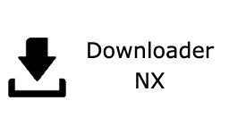

# Downloader-NX

## WARNING
I decided to abandon this project for good reasons. \
A very good reason is that this project wouldn't see much use. \
You might just use it to download something for Switch CFW, and there are many other apps that can do that. \
So this project isn't really useful. If you want to improve this project, feel free to.

A cross-platform download manager for the Nintendo Switch. GUI powered by borealis.

Downloader works by getting URL links to download from and filenames to name the downloaded files.
It then uses curl to download all of the files queued.

In-progress right now. Look at the Projects tab to see the progress!

# Compiling

Blank (for now)

# Credits

Blank (for now)

# License

Downloader-NX is licensed under the GPL v3.0 license. See license.md for more details.